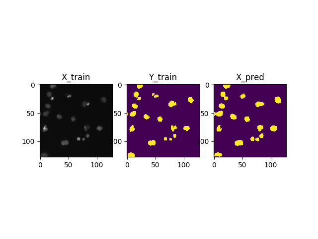
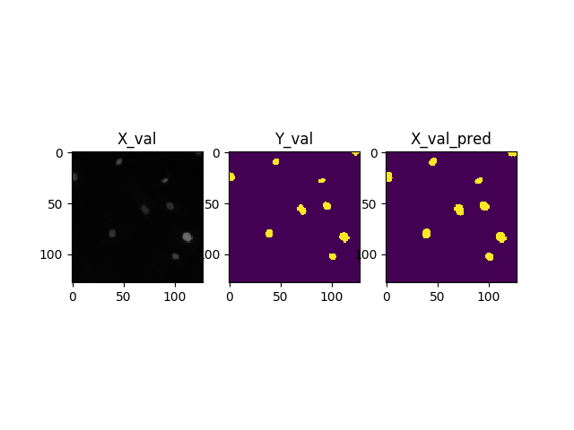
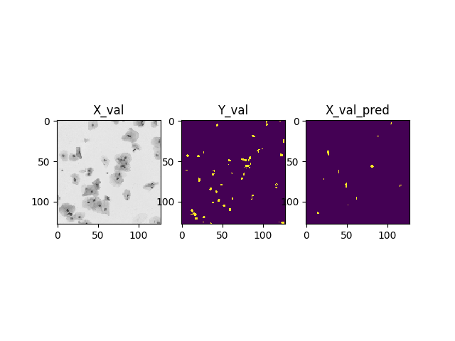

# U_net
u_net for semantic segmentation

# model architecture

# Data
https://www.kaggle.com/c/data-science-bowl-2018

# changes

- module화
- save result image

# result

- 작은 feature는 잘 못잡아내고 있다.

# reference
https://www.kaggle.com/keegil/keras-u-net-starter-lb-0-277
